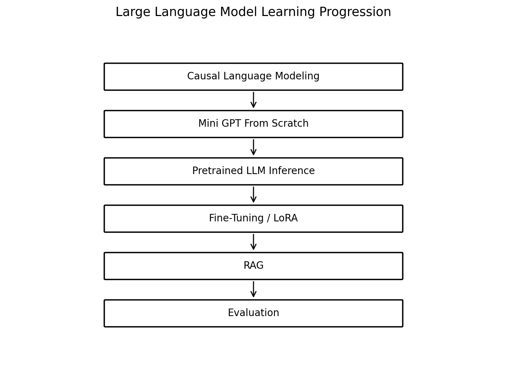

# Large Language Models

This portfolio section continues from **Sequence Modeling** and **Attention and Transformer Architectures**. It does not treat LLMs as black-box APIs. Instead, it moves from the core mechanics of causal language modeling to pretrained inference, efficient adaptation, retrieval-augmented generation, and evaluation.



## Learning Progression

```text
Sequence Modeling
        ↓
Attention and Transformer Architectures
        ↓
Causal Language Modeling
        ↓
Mini GPT From Scratch
        ↓
Pretrained LLM Inference
        ↓
Decoding and Generation
        ↓
Fine-Tuning
        ↓
LoRA / PEFT
        ↓
Retrieval-Augmented Generation
        ↓
LLM Evaluation and Failure Analysis
```

## Repository Structure

```text
13. Large Language Models/
│
├── README.md
├── requirements.txt
├── .gitignore
│
├── 01_causal_language_modeling_and_gpt_from_scratch.ipynb
├── 02_pretrained_llm_inference_and_text_generation.ipynb
├── 03_llm_finetuning_and_lora.ipynb
├── 04_retrieval_augmented_generation_and_evaluation.ipynb
│
├── data/
│   └── README.md

```

## Notebook 1 — Causal Language Modeling and GPT From Scratch

**Purpose:** understand how a Transformer becomes an autoregressive language model.

Topics include:

- next-token prediction,
- character tokenization from scratch,
- vocabulary and token IDs,
- shifted input-target sequences,
- context length and batching,
- token and positional embeddings,
- causal masking,
- self-attention and multi-head attention,
- feed-forward networks,
- residual connections and normalization,
- decoder-block stacking,
- language-model logits,
- cross-entropy loss,
- perplexity,
- training a mini GPT,
- greedy, temperature, and top-k generation,
- limitations of small educational language models.

## Notebook 2 — Pretrained LLM Inference and Text Generation

**Purpose:** move from a hand-built mini GPT to a pretrained causal model while keeping the inference pipeline transparent.

Topics include:

- pretrained models,
- modern subword tokenization,
- input IDs and attention masks,
- model architecture and parameter count,
- manual next-token prediction from logits,
- top candidate token probabilities,
- greedy decoding,
- beam search,
- temperature,
- top-k and top-p sampling,
- repetition penalties,
- context length,
- KV caching,
- hallucination and model-knowledge limitations.

## Notebook 3 — LLM Fine-Tuning and LoRA

**Purpose:** understand how pretrained language models can be adapted efficiently.

Topics include:

- pretraining vs prompting vs fine-tuning,
- instruction tuning,
- full fine-tuning cost,
- parameter-efficient fine-tuning,
- LoRA mathematics,
- rank, alpha, dropout, and target modules,
- dataset formatting and tokenization,
- base-model baseline,
- total vs trainable parameter counts,
- PEFT implementation,
- adapter training,
- validation,
- base vs adapted outputs,
- strengths and limitations of LoRA.

## Notebook 4 — Retrieval-Augmented Generation and Evaluation

**Purpose:** move from an LLM model to a grounded LLM system.

Topics include:

- why RAG is needed,
- document corpora,
- chunking and overlap,
- text embeddings,
- cosine similarity,
- top-k retrieval,
- context construction,
- LLM generation with and without retrieval,
- Hit Rate@k,
- Precision@k,
- groundedness and faithfulness concepts,
- evidence-overlap diagnostics,
- retrieval vs generation failure analysis,
- advanced RAG extensions.


## Suggested Environment

Google Colab is recommended if a local GPU is unavailable. The first notebook can run on CPU but trains faster on a GPU. The remaining notebooks download small pretrained models from Hugging Face.

Install dependencies with:

```bash
pip install -r requirements.txt
```

## Main Libraries

- Python
- PyTorch
- Transformers
- Datasets
- PEFT
- Sentence Transformers
- pandas
- NumPy
- Matplotlib

## What This Folder Demonstrates

 It demonstrates understanding of:

- how causal language models learn,
- how GPT-style decoder networks are assembled,
- what pretrained LLM inference actually computes,
- how decoding changes generated text,
- how LoRA adapts model behavior efficiently,
- how retrieval adds external knowledge,
- and how LLM systems should be evaluated and debugged.

## Natural Next Step

After this core LLM section, an optional advanced portfolio folder could cover **instruction tuning at scale, DPO/preference optimization, tool use, LLM agents, advanced RAG, multimodal models, quantization, and serving**. 
