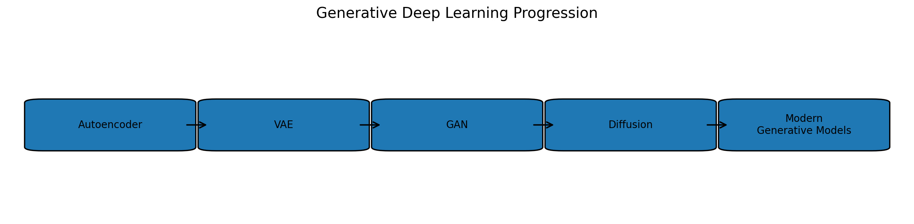

# 14. Generative Deep Learning

This portfolio section develops generative deep learning as a progression from the representation-learning ideas introduced earlier in the Deep Learning portfolio.

The goal is **not** to use generative models as black boxes. Each notebook begins with the underlying idea, builds a small manual example, introduces the mathematics, inspects intermediate values and tensor shapes, implements the important mechanism explicitly, and only then trains a complete model.

## Learning Progression



```text
Autoencoder knowledge
        ↓
Variational Autoencoder
        ↓
Probabilistic latent modeling
        ↓
Generative Adversarial Network
        ↓
Adversarial generation
        ↓
Diffusion Model
        ↓
Iterative denoising generation
```

## Repository Structure

```text
14. Generative Deep Learning/
│
├── README.md
├── requirements.txt
├── .gitignore
│
├── 01_variational_autoencoders_from_scratch.ipynb
├── 02_generative_adversarial_networks_from_scratch.ipynb
├── 03_diffusion_models_from_scratch.ipynb
│
├── data/
│   └── README.md
│
└── images/
    ├── 01_generative_learning_progression.png
    ├── 02_vae_pipeline.png
    ├── 03_gan_pipeline.png
    ├── 04_diffusion_pipeline.png
    └── 05_compare_generative_models.png
```

## Notebook 1 — Variational Autoencoders From Scratch

This notebook extends ordinary Autoencoders into probabilistic generative modeling.

Progression:

```text
Autoencoder review
    ↓
Generative modeling
    ↓
Gaussian latent distributions
    ↓
Mean and log-variance
    ↓
Reparameterization trick
    ↓
Reconstruction loss
    ↓
KL divergence
    ↓
VAE objective / ELBO intuition
    ↓
VAE implementation
    ↓
Training
    ↓
Latent-space visualization
    ↓
Random generation
    ↓
Latent interpolation
    ↓
β-VAE concept
```

Portfolio evidence:

- explains why standard Autoencoders are not automatically good generative models,
- derives the practical VAE loss components,
- implements reparameterization explicitly,
- visualizes a 2-D latent space,
- generates samples from the prior,
- explores interpolation and the reconstruction-regularization trade-off.

## Notebook 2 — Generative Adversarial Networks From Scratch

This notebook introduces adversarial generation.

Progression:

```text
Generator
    +
Discriminator
    ↓
Minimax game
    ↓
Binary cross-entropy objectives
    ↓
Latent noise
    ↓
Generator architecture
    ↓
Discriminator architecture
    ↓
Alternating optimization
    ↓
Training
    ↓
Fixed-noise comparison
    ↓
Latent interpolation
    ↓
Equilibrium
    ↓
Mode collapse and instability
```

Portfolio evidence:

- distinguishes generator and discriminator optimization,
- implements the alternating training procedure explicitly,
- explains non-saturating generator loss,
- analyzes GAN loss behavior,
- demonstrates latent-space interpolation,
- discusses failure modes and the progression toward DCGAN/WGAN/StyleGAN.

## Notebook 3 — Diffusion Models From Scratch

This notebook develops a small DDPM-style model from first principles.

Progression:

```text
Forward noising
    ↓
β schedule
    ↓
α and cumulative α
    ↓
Closed-form x_t sampling
    ↓
Noise visualization
    ↓
Timestep embeddings
    ↓
Noise-prediction network
    ↓
MSE objective
    ↓
Training
    ↓
Reverse diffusion
    ↓
Generation from pure noise
    ↓
DDIM
    ↓
Classifier-free guidance
    ↓
Latent diffusion
```

Portfolio evidence:

- constructs the diffusion schedule manually,
- visualizes the destruction of image structure across timesteps,
- implements the forward noising equation,
- builds a timestep-conditioned noise predictor,
- implements reverse sampling,
- connects the educational model to DDIM, guidance, U-Nets, and latent diffusion.

## Why This Folder Is Separate From Autoencoders

The earlier **Autoencoders** folder focuses primarily on:

```text
encoding
→ reconstruction
→ denoising
→ latent representation
```

This Generative Deep Learning folder moves beyond reconstruction into:

```text
probabilistic sampling
adversarial generation
iterative denoising generation
```

The VAE notebook intentionally begins with Autoencoder knowledge because that is the natural conceptual bridge.

## Why GANs Are Separate From Adversarial Machine Learning

The earlier **Adversarial Machine Learning** section focuses on model robustness, adversarial perturbations, attacks, and defenses.

A GAN uses the word *adversarial* differently:

```text
Generator
vs.
Discriminator
```

The adversarial game is used to learn a data distribution for generation rather than to attack a classifier.


## Visual Explanations

Static diagrams are included for:

- overall generative-learning progression,
- VAE architecture,
- GAN architecture,
- diffusion forward/reverse process,
- comparison of VAE, GAN, and diffusion ideas.

The notebooks also generate visual evidence when run:

- probability distributions,
- original vs reconstructed images,
- latent-space plots,
- generated images,
- interpolation sequences,
- GAN loss curves,
- diffusion noising sequences,
- diffusion training loss,
- reverse-generated samples.

## Recommended Runtime

Google Colab is recommended.

A GPU is useful for the GAN and diffusion notebooks, although the models are intentionally kept small enough to remain educational and manageable.

For quick verification, reduce the number of epochs. For final portfolio results, increase training and save representative outputs.

## Skills Demonstrated

- generative modeling fundamentals,
- probabilistic latent-variable modeling,
- KL divergence and ELBO intuition,
- reparameterization trick,
- adversarial optimization,
- generator and discriminator training,
- mode collapse and GAN instability,
- diffusion schedules,
- noise-prediction training,
- timestep conditioning,
- reverse diffusion sampling,
- model comparison and failure analysis.


